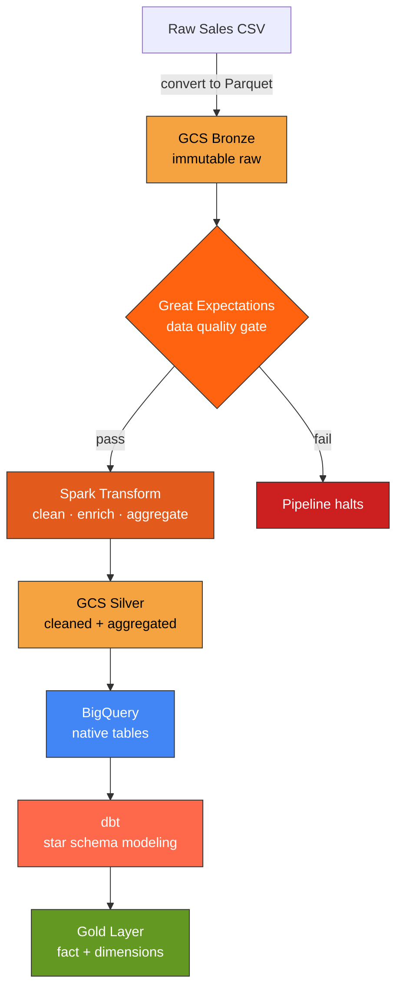
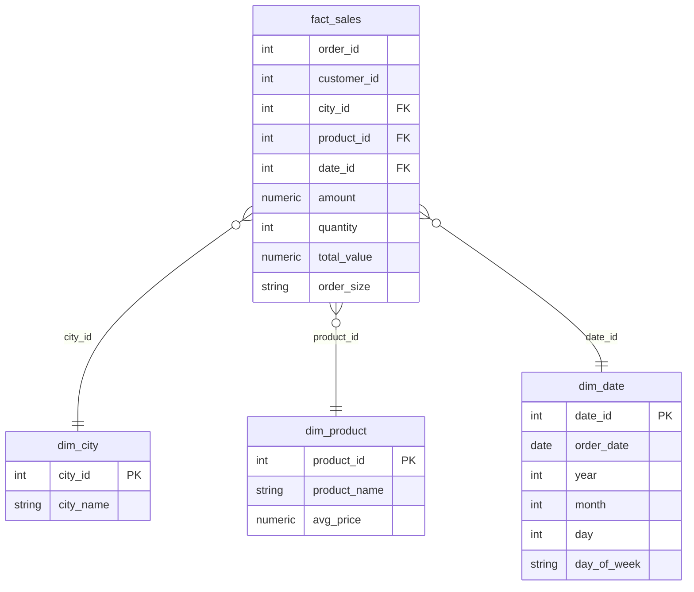

# RetailCo Modern Data Stack Pipeline

An end-to-end, production-grade data pipeline that transforms raw retail sales data into an analytics-ready star schema. Built on a modern data stack with containerized orchestration, automated data quality gates, and CI/CD.

<p align="left">
  
  
  
  
  
  
  
</p>

---

## Overview

This pipeline ingests raw sales transactions, validates them against a data quality contract, transforms them at scale with Spark, loads them into BigQuery, and models them into a dimensional star schema with dbt. The entire workflow runs with a single command via Docker Compose and is continuously tested through GitHub Actions.

The architecture follows the **medallion pattern** (Bronze → Silver → Gold), separating immutable raw data from cleaned and curated layers for reprocessing safety and auditability.

---

## Architecture



---

## Data Model

The Gold layer implements a star schema optimized for analytical queries: a central fact table surrounded by conformed dimensions.



---

## Tech Stack

| Layer | Technology | Purpose |
|-------|-----------|---------|
| Storage | Google Cloud Storage | Data lake (Bronze / Silver layers) |
| Processing | Apache Spark | Distributed transformation and aggregation |
| Warehouse | BigQuery | Analytical query engine |
| Modeling | dbt | Star schema transformation and testing |
| Data Quality | Great Expectations | Validation gate before processing |
| Orchestration | Docker Compose | Single-command pipeline execution |
| CI/CD | GitHub Actions | Automated testing and branch protection |
| File Format | Parquet | Columnar, compressed, schema-aware storage |

---

## Pipeline Stages

**1 · Ingestion** — Raw CSV is converted to Parquet and uploaded to the GCS Bronze layer as immutable raw data.

**2 · Data Quality** — Great Expectations validates the Bronze layer against seven expectations (non-null keys, positive amounts, valid category sets). A failed check halts the pipeline before any processing occurs.

**3 · Transformation** — Spark reads Bronze, cleans and enriches transactions (standardization, derived columns), aggregates by city and product, and writes two Silver datasets.

**4 · Load** — Silver Parquet is natively loaded into BigQuery with idempotent overwrite semantics.

**5 · Modeling** — dbt builds a staging view and materializes a star schema (one fact, three dimensions) with automated uniqueness and not-null tests.

---

## Data Quality

Validation runs as the first stage of the pipeline, enforcing a data contract before any compute is spent:

| Expectation | Column | Rule |
|-------------|--------|------|
| Not null | `order_id` | Every transaction has an identifier |
| Unique | `order_id` | No duplicate transactions |
| Not null | `amount` | Price is always present |
| Positive | `amount` | No zero or negative prices |
| Positive | `quantity` | No zero or negative quantities |
| In set | `city` | Only known cities |
| In set | `product` | Only known products |

If any expectation fails, the process exits with a non-zero code, and downstream stages never run.

---

## CI/CD

Every push and pull request triggers two automated jobs via GitHub Actions:

- **Python Syntax Check** — flags critical syntax and logic errors across all scripts.
- **dbt Build & Test** — rebuilds the star schema from the latest code and runs all dbt tests against BigQuery.

The `master` branch is protected: merges are blocked unless both checks pass, ensuring the main branch is always in a working state.

---

## Running the Pipeline

**Prerequisites:** Docker, a GCP service account key with BigQuery and GCS access.

```bash
# Set credentials
export GOOGLE_APPLICATION_CREDENTIALS=/path/to/key.json

# Run the entire pipeline with one command
docker compose up --build
```

Services execute in dependency order — each stage runs only if the previous one succeeds:

```
data_quality → spark_transform → bigquery_load → dbt_run
```

---

## Project Structure

```
retailco-modern-data-stack/
├── data/raw/              # Source data and generator
├── ingestion/            # CSV to GCS Bronze (Parquet)
├── data_quality/         # Great Expectations validation
├── spark/                # Bronze to Silver transformation
├── load/                 # Silver to BigQuery loader
├── dbt/retailco/         # Star schema models and tests
├── Dockerfile            # Pipeline image definition
├── docker-compose.yml    # Orchestration
└── .github/workflows/    # CI/CD pipeline
```

---

## Key Engineering Decisions

- **Medallion architecture** separates immutable raw data from cleaned layers, enabling safe reprocessing and audit trails.
- **Parquet over CSV** for columnar storage, compression, and predicate pushdown.
- **Native BigQuery load** over external tables, prioritizing query performance for repeated dbt runs.
- **Data quality as a gate**, not an afterthought — bad data is rejected before compute is spent.
- **Idempotent writes** throughout (overwrite semantics), so re-running the pipeline produces consistent results.
